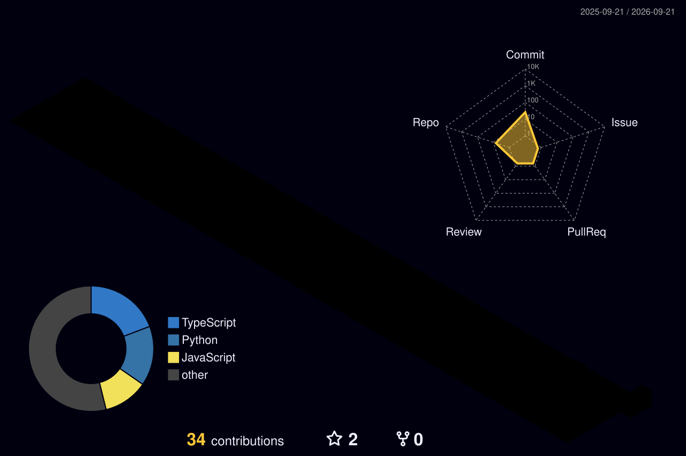

<!--
╔══════════════════════════════════════════════════════════════════╗
║             PABAN KUMAR SAHOO — GITHUB PROFILE                 ║
║     Full-Stack Developer • AI Enthusiast • Builder             ║
╚══════════════════════════════════════════════════════════════════╝
-->

<div align="center">


<a href="https://readme-typing-svg.demolab.com/">

</a>

<br/>

<a href="https://github.com/pabankumarsahoo">

</a>
<a href="https://in.linkedin.com/in/paban-kumar-sahoo-4035a6371">

</a>
<a href="mailto:pabankumar98270@gmail.com">

</a>

<br/><br/>


</div>

---

<table>
<tr>
<td width="36%" align="center">


<br/><br/>

**PABAN KUMAR SAHOO**

`Full-Stack Developer`

`AI Enthusiast`

`B.Tech CSE • 2027`

</td>

<td width="64%">

## 🧑‍💻 About Me

I'm **Paban Kumar Sahoo**, a Computer Science Engineering student and aspiring **Full-Stack Developer** who enjoys turning ideas into practical, scalable and intelligent applications.

My interests sit at the intersection of **modern web development, backend engineering, artificial intelligence, data and cloud computing**.

I learn by building — experimenting with technologies, solving problems, breaking things, understanding why they broke, and improving the system.

```text
┌─────────────────────────────────────────────────────────────┐
│  > whoami                                                   │
│                                                             │
│  Paban Kumar Sahoo                                          │
│  Full-Stack Developer • AI Enthusiast                      │
│                                                             │
│  BUILDING                                                   │
│  ├── React.js interfaces                                    │
│  ├── Python / FastAPI backends                             │
│  ├── SQL-powered applications                              │
│  ├── AI / LLM-powered systems                              │
│  └── Cloud-ready applications                              │
│                                                             │
│  CURRENT MODE                                               │
│  [████████████████████████████████████] LEARNING + BUILDING │
└─────────────────────────────────────────────────────────────┘
```

</td>
</tr>
</table>

---


<h2 align="center">📊 My 3D Contribution Graph</h2>

<p align="center">
  
</p>

<h2 align="center">🐍 My Contribution Snake</h2>

<p align="center">
  
</p>

<h2 align="center">📈 GitHub Analytics</h2>

<p align="center">
  
  
</p>

<h2 align="center">🔥 GitHub Contribution Streak</h2>

<p align="center">
  
</p>

## 🚀 What I Build

```text
Frontend ────────────────┐
                         │
Backend ─────────────────┤
                         ├──► Full-Stack Applications
Database ────────────────┤
                         │
Cloud / DevOps ──────────┘

AI / LLM ────────────────┐
RAG / Agents ────────────┤──► Intelligent Applications
Data / Analytics ────────┘
```

- 💻 Responsive full-stack web applications
- ⚙️ REST APIs and backend services
- 🤖 AI-powered features, LLM workflows and experiments
- 🧠 RAG, prompt engineering and Agentic AI exploration
- 📊 Data analytics and visualization
- ☁️ Cloud and deployment workflows
- 🔐 Authentication, databases and API integrations

---

## 🧠 Tech Arsenal

<div align="center">

### Languages


<br/><br/>

### Frontend


<br/><br/>

### Backend


<br/><br/>

### Database & Data

<br/><br/>


<br/><br/>

### AI / GenAI


<br/><br/>

### Cloud / DevOps / Tools


</div>

---

## 🏗️ Featured Work

<table>
<tr>
<td width="50%">

### 🧠 AI Project Mentor

AI-assisted project mentoring platform built around a modern full-stack architecture.

**Stack**

`React.js` `FastAPI` `Python` `SQL Server` `LLM` `Ollama`

<a href="https://github.com/pabankumarsahoo/AI_Project_Mentor_BE">

</a>

</td>

<td width="50%">

### 🩺 AI Doctor Appointment System

Full-stack healthcare application concept combining appointment management with AI-assisted doctor/department recommendations.

**Stack**

`Django` `React.js` `MySQL` `AI` `NLP` `REST API`

</td>
</tr>

<tr>
<td width="50%">

### 📊 HealthOps IQ

Healthcare operations analytics project using medallion architecture, Delta tables, KPIs and Power BI.

**Stack**

`Databricks` `SQL` `Delta Lake` `Power BI` `DAX`

</td>

<td width="50%">

### 🌐 Portfolio Platform

Personal developer portfolio with a modern frontend, FastAPI backend, SQL Server persistence and contact/email workflow.

**Stack**

`React` `FastAPI` `SQL Server` `AWS` `REST API`

</td>
</tr>
</table>

---

## 🏆 Milestones

<div align="center">

| 🚀 | Milestone |
|---|---|
| 🏆 | Smart India Hackathon Finalist |
| 🎓 | B.Tech Computer Science & Engineering — 2027 |
| 📊 | Data Analytics Internship — A2R Software Consulting Pvt. Ltd. |
| 🎖️ | NCC Cadet — C Certificate |
| 💻 | Full-Stack + AI project development |
| ☁️ | AWS / Docker / cloud engineering learning |

</div>

---

# 📊 GitHub Command Center

<div align="center">

<a href="https://github.com/pabankumarsahoo">

</a>

<a href="https://github.com/pabankumarsahoo">

</a>

<br/><br/>


</div>

---

## 📈 Contribution Activity

<div align="center">


<br/><br/>


</div>

---

## 🏅 GitHub Achievements

<div align="center">


</div>

---

# 🧊 3D Contribution Universe

> Your contribution history is rendered as an automatically updated 3D visualization by GitHub Actions.

<div align="center">


</div>

---

# 🐍 Contribution Snake

<div align="center">

<picture>
  <source media="(prefers-color-scheme: dark)" srcset="https://raw.githubusercontent.com/pabankumarsahoo/pabankumarsahoo/output/github-snake-dark.svg">
  <source media="(prefers-color-scheme: light)" srcset="https://raw.githubusercontent.com/pabankumarsahoo/pabankumarsahoo/output/github-snake.svg">
  
</picture>

</div>

---

## 🧩 Developer Mindset

<div align="center">

```text
                 ┌───────────────┐
                 │     IDEA      │
                 └───────┬───────┘
                         │
                         ▼
                 ┌───────────────┐
                 │     BUILD     │
                 └───────┬───────┘
                         │
                         ▼
                 ┌───────────────┐
                 │     BREAK     │
                 └───────┬───────┘
                         │
                         ▼
                 ┌───────────────┐
                 │    DEBUG      │
                 └───────┬───────┘
                         │
                         ▼
                 ┌───────────────┐
                 │     LEARN     │
                 └───────┬───────┘
                         │
                         ▼
                 ┌───────────────┐
                 │    EVOLVE     │
                 └───────────────┘
```

### **I don't just learn technology. I build with it.**

</div>

---

## 🔭 Currently Exploring

<div align="center">

`Advanced Python` • `FastAPI` • `React.js` • `AWS` • `Docker`  
`LLMs` • `RAG` • `Agentic AI` • `Prompt Engineering` • `System Design`

</div>

---

## 📚 Learning Philosophy

> **Learn deeply. Build consistently. Understand the "why".**

I believe every project is an opportunity to understand something one level deeper.

**Tutorial → Experiment → Project → Problem → Solution → Better Project**

---

## 🤝 Let's Connect

<div align="center">

<a href="mailto:pabankumar98270@gmail.com">

</a>

<a href="https://in.linkedin.com/in/paban-kumar-sahoo-4035a6371">

</a>

<a href="https://github.com/pabankumarsahoo">

</a>

<br/><br/>

**Open to:** Full-Stack Development • AI Projects • Internships • Collaboration • Open Source

</div>

---

## 💬 Developer Quote

<div align="center">


</div>

---

<div align="center">

### ⚡ Code. Create. Learn. Evolve.


</div>
